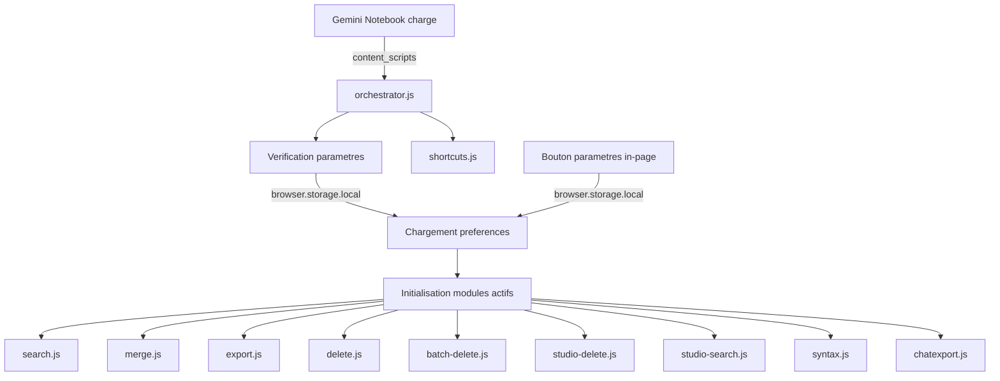

# Architecture — Magic Manager for Gemini Notebook

## Vue d'ensemble

Magic Manager est une extension Firefox (Manifest V3) de type **content-script-only**. Elle ne possède ni background script, ni service worker permanent. Toute la logique s'exécute dans le contexte de la page Gemini Notebook (anciennement NotebookLM) via des content scripts injectés.

## Arborescence du projet

```
magic-manager/
├── manifest.json              # Manifeste MV3 de l'extension
├── src/
│   ├── api/
│   │   └── rpcclient.js       # Client RPC pour l'API Gemini Notebook (batchexecute)
│   ├── content/
│   │   ├── orchestrator.js    # Point d'entrée — orchestrateur des modules
│   │   ├── modules/           # Sous-modules de l'extension
│   │   │   ├── source-helpers.js # Fonctions centralisées DOM des sources
│   │   │   ├── source-badges.js  # Module de badges visuels de sources
│   │   │   ├── shortcuts.js   # Module de raccourcis clavier
│   │   │   ├── search.js      # Module de recherche globale
│   │   │   ├── merge.js       # Module de fusion intelligente
│   │   │   ├── export.js      # Module d'exports simplifiés
│   │   │   ├── delete.js      # Module de suppression en ligne
│   │   │   ├── batch-delete.js # Module de suppression par lot de sources
│   │   │   ├── studio-delete.js # Module de suppression par lot du Studio
│   │   │   ├── studio-search.js # Module de recherche et filtrage du Studio [NEW]
│   │   │   ├── syntax.js      # Module de coloration syntaxique
│   │   │   └── chatexport.js  # Module d'export du chat
│   │   └── ui/                # Composants d'interface partagés
│   │       ├── dialogs.js     # Boîtes de dialogue Material Design 3
│   │       └── settings.js    # Panneau de réglages utilisateur
│   └── styles/
│       └── magic-manager.css  # Styles injectés dans la page Gemini Notebook
├── _locales/
│   ├── en/messages.json       # Locale par défaut (anglais)
│   ├── fr/messages.json       # Français
│   ├── es/messages.json       # Espagnol
│   ├── de/messages.json       # Allemand
│   ├── pt/messages.json       # Portugais brésilien
│   ├── ja/messages.json       # Japonais
│   └── vi/messages.json       # Vietnamien
├── icons/
│   ├── icon.svg               # Icône vectorielle (SVG standardisé)
├── tools/
│   └── check-i18n.js          # Vérification de couverture i18n
├── README.md
├── ARCHITECTURE.md
├── CHANGELOG.md
├── AGENTS.md
├── spec.md
├── LICENSE
└── .gitignore
```

## Flux de données



## Système i18n

L'extension utilise le système natif `browser.i18n.getMessage()` de WebExtension :
- **Locale par défaut** : `en` (définie dans `manifest.json` via `default_locale`)
- **7 locales supportées** : en, fr, es, de, pt, ja, vi
- **Clés normalisées** : camelCase, sans préfixe de module
- **Vérification** : `node tools/check-i18n.js` valide la couverture de toutes les locales cibles

## Paramétrage

Chaque fonctionnalité peut être activée/désactivée individuellement via le micro-menu de paramètres (⚙️) injecté directement dans la page en bas à gauche de la liste des sources. Les préférences sont stockées dans `browser.storage.local` avec les clés suivantes :

| Clé | Type | Défaut | Description |
|---|---|---|---|
| `feature_shortcuts` | `boolean` | `true` | Raccourcis clavier |
| `feature_search` | `boolean` | `true` | Recherche globale |
| `feature_badges` | `boolean` | `true` | Badges visuels de sources |
| `feature_merge` | `boolean` | `true` | Fusion intelligente |
| `feature_export` | `boolean` | `true` | Exports simplifiés |
| `feature_delete` | `boolean` | `true` | Suppression en ligne |
| `feature_batchDelete` | `boolean` | `true` | Suppression par lot (sources + Studio) |
| `feature_studioSearch` | `boolean` | `true` | Recherche et filtrage du Studio |
| `feature_syntax` | `boolean` | `true` | Coloration syntaxique |
| `feature_chatExport` | `boolean` | `true` | Export du chat |

## Couche de transport RPC

L'extension s'affranchit des simulations d'interactions DOM (fragiles et sources d'effets visuels secondaires) pour les opérations lourdes en exploitant directement l'API interne `batchexecute` de Gemini Notebook (anciennement NotebookLM) :
- **Résilience réseau (v0.5.4)** : Intégration d'un timeout de 30 secondes (via `AbortController`) et d'un retry exponentiel adaptatif (3 tentatives, gestion de `Retry-After`) sur toutes les requêtes RPC.
- **GET_SOURCE (`hizoJc`)** : Permet de récupérer le texte brut indexé d'une source à l'index `[3][0]` (ou l'HTML de rendu à `[4][1]`), sans charger le document dans le visualiseur DOM de la page.
- **CREATE_NOTE (`CYK0Xb`) / UPDATE_NOTE (`cYAfTb`)** : Création séquentielle robuste en tâche de fond pour exporter les conversations de chat en notes sans focus automatique de l'interface Google.
- **DELETE_SOURCE (`tGMBJ`) / ADD_SOURCE (`izAoDd`)** : Appels directs utilisant des structures de tableaux doublement et triplement enveloppées pour des mutations réseau résilientes.
- **DELETE_NOTE (`AH0mwd`) / DELETE_ARTIFACT (`V5N4be`)** : Appels directs pour la suppression d'éléments du Studio.
- **GET_NOTES_AND_MIND_MAPS (`cFji9`) / LIST_ARTIFACTS (`gArtLc`)** : Requêtes permettant de récupérer les éléments du Studio en tâche de fond afin d'effectuer le mapping titre ↔ ID requis pour la suppression batch.
- **Infrastructure batch multi-RPC (`sendBatchMultiple`)** : Encapsule plusieurs requêtes RPC différentes dans un seul POST réseau `batchexecute` en empilant les tuples de requêtes dans le tableau externe de l'enveloppe `f.req`. En cas d'échec global du batch, un fallback séquentiel avec rate limiting (300ms entre les requêtes) est automatiquement exécuté.

## Composants d'interface (Modales & Dialogues)

Depuis la version 0.5.4, toutes les boîtes de dialogue et la modale de fusion utilisent l'élément HTML5 natif `<dialog>`. Cela garantit :
- Un comportement standardisé de la modale via `.showModal()`.
- Une gestion native et sécurisée du Focus Trap (le focus clavier reste piégé dans le dialogue).
- Une fermeture automatique et cohérente via la touche `Escape` (via l'événement `cancel` intercepté).
- Une conformité totale avec les critères WCAG 2.1 AA pour l'accessibilité des modales (rôles et états ARIA intégrés).
- **Protection Anti-Processus Fantôme (v0.5.9)** : Afin d'éviter qu'un traitement asynchrone (comme la fusion de sources) ne continue à s'exécuter en tâche de fond après la fermeture ou l'annulation de la modale par l'utilisateur, un témoin d'annulation (`isCancelled`) est lié à l'événement `close` du dialogue et interrompt immédiatement le traitement réseau et la création de sources.

## Cycle d'observation, Performance et Mode Mobile (Coordinateur)

Pour garantir une expérience utilisateur fluide sur la SPA Gemini Notebook sans pénaliser les performances :
- **Observer Centralisé (v0.5.9)** : Au lieu d'avoir plusieurs MutationObservers concurrents scrutant `document.body` en continu, un unique observateur global dans `panel-observer.js` centralise la surveillance du DOM. Avec un debounce de 250ms, il coordonne et distribue les injections pour la barre de recherche, l'export de chat, et la coloration syntaxique. Pour optimiser l'usage du processeur (CPU) lors du streaming de réponses IA, l'observation est restreinte à la racine de l'application `<app-root>` (avec repli sur `document.body`).
- **Observation Réactive des Checkboxes (MutationObserver d'Attributs)** : Pour éviter tout retard de décompte (race condition) et éliminer la surécoute CPU au survol ou au scroll, Magic Manager n'utilise pas de listeners click/change généraux. L'observer du panneau sources écoute les mutations d'attributs (`attributes: true` avec `attributeFilter: ['class', 'aria-checked']`) sur les checkboxes Angular Material (`mat-pseudo-checkbox`). Le recalcul du décompte ne s'effectue qu'à l'ajout/suppression de sources (`childList`) ou lors d'une mutation d'attribut sur une checkbox.
- **Verrou d'Idempotence par Compteur (v0.5.9)** : Pour éliminer toute boucle infinie d'injections réactives (cycles de mutation DOM provoquant des réinjections en cascade), les fonctions de boutons batch s'appuient sur un double verrou d'idempotence basé sur le nombre de sources cochées. Si le compte n'a pas changé et que le bouton est déjà présent dans la bonne ancre, le DOM n'est pas modifié, stoppant net les boucles de l'observateur.
- **Optimisation DOM et TreeWalker (v0.5.9)** : L'utilisation de traversées récursives du Shadow DOM a été entièrement abandonnée au profit de requêtes CSS `querySelectorAll` natives. Pour la coloration syntaxique (où la recherche dans les Shadow Roots est requise), l'algorithme récursif a été optimisé à l'aide d'un `TreeWalker` natif, évitant ainsi le scan répétitif `querySelectorAll('*')` sur l'ensemble de l'arbre et ramenant la complexité de O(N²) à O(N) sur les longs fils de discussion.
- **Gestion Stricte du Cycle de Vie (v0.5.9)** : Afin d'éviter les fuites de ressources et les injections fantômes de boutons, tous les timers d'initialisation (`setTimeout`) lancés par les modules lors de leur activation sont systématiquement référencés et annulés (`clearTimeout`) lors de leur arrêt (`cleanup`). Les styles CSS des modales de fusion ont également été migrés de l'injection dynamique JS à un chargement CSS statique via le manifeste de l'extension.
- **ResizeObserver, En-tête mobile & Clics Onglets** : Un `ResizeObserver` écoute en permanence le redimensionnement du document. Si la visibilité réelle des panneaux sources et chat (mesurée par `offsetParent`) indique un basculement de layout (passage en mode onglets), Magic Manager bascule ses injections :
  - **En-tête Mobile Collant** : Création d'une barre fixe `.mm-sticky-header` en haut de la liste de sources, regroupant à gauche la barre de recherche et à droite les boutons batch (fusion/export), empêchant leur défilement ou disparition au scroll.
  - **Gestion Réactive des Onglets** : Pour capter le basculement d'onglet mobile (géré de façon interne par Angular), l'extension écoute les clics sur les onglets (`[role="tab"]`) et planifie une réinjection complète et un recalcul de l'UI 300ms après la transition.
  - **Ancrage Individuel Résilient** : Si le header de section est masqué, les boutons individuels d'export et de suppression s'ancrent automatiquement sur le bouton natif de retour/fermeture (`button[mattooltip="Close source view"]`) du document ouvert.
- **Loi de Repli de la Barre de Recherche** : Pour éviter que la barre de recherche MM ne déborde lorsque l'utilisateur replie/minimise le panneau sources en mode bureau, l'extension mesure la largeur réelle de `section.source-panel`. Si `width < 120px`, la barre de recherche est automatiquement masquée (`display: none`). Elle réapparaît dès que le panneau est déplié.
- **Raccourcis Clavier Globaux et Captures Clavier (v0.6.3)** : Un écouteur unique d'événements `keydown` est enregistré globalement sur `document` en phase de capture (`true`) par le module `shortcuts.js`. Cela permet d'intercepter les raccourcis de productivité (`Cmd/Ctrl+Shift+F`, `Cmd/Ctrl+Shift+E`, `Option/Alt+Shift+F`) avant qu'ils ne soient consommés par NotebookLM.
- **Dédoublonnage Hybride Local et Réseau (v0.6.4)** : La recherche de doublons s'exécute au clic utilisateur en combinant deux passes indépendantes fusionnées (union) :
  1. Passe locale instantanée via le coefficient de Sørensen-Dice sur les bigrammes des titres (Dice score ≥ 0.8) pour un affichage visuel préliminaire immédiat.
  2. Passe réseau asynchrone autonome scannant toutes les sources du carnet par requêtes RPC `getSourceContent` (`hizoJc`). Le contenu est comparé par paires avec le coefficient de Jaccard sur les ensembles de mots significatifs (> 3 lettres) avec un seuil de similarité ≥ 0.6. Cette méthode élimine les faux négatifs causés par les pipelines d'importation différents (Drive, URL, PDF local) ou les titres renommés.
- **Bouton de Réinitialisation Croix (×)** : Intégration d'un bouton croix positionné en absolute dans la barre de recherche. Sa visibilité est liée dynamiquement à la présence de texte dans le champ de recherche par toggles de classe CSS.
- **Badges de type de source (v0.7.0)** : Les métadonnées de provenance (Google Drive, URL, Fichier local) sont récupérées via l'API RPC `rLM1Ne` et stockées en cache local (Map normalisée `titre -> type`). Les badges de couleur associés (🔄 Drive, 🌐 URL/YouTube, ▢ Upload Local) sont injectés dynamiquement de façon réactive dans le DOM des cartes sources. Pour faire face aux retards de rendu d'Angular (SPA) et aux asynchronismes :
  - **Invalidation sur transition SPA** : Le module détecte immédiatement les changements de Notebook ID dès l'entrée de `injectBadges()`, ce qui vide le cache local et réinitialise les compteurs lors de la navigation dynamique entre carnets.
  - **Retry progressif avec backoff** : Si la liste des sources dans le DOM est initialement vide ou si des cartes n'ont pas encore reçu de badge (titre non encore hydraté par Angular), un retry automatique est planifié avec des délais croissants (500ms, 1s, 1.5s, 2s, 3s) bornés à 5 tentatives max, qui s'auto-annule dès que toutes les cartes ont leur badge.
  - **Sentinelle d'idempotence** : Utilisation de l'attribut `data-mm-badge` sur les cartes pour éviter les multi-injections de badges lors des mutations DOM ultérieures.
- **Recherche et Filtrage du Studio (v0.9.0)** : Le module `studio-search.js` injecte une pilule de recherche rétractable dans le panneau Studio (Notes & Artéfacts) avec les mécanismes suivants :
  - **Cache RPC hybride** : Les métadonnées du Studio sont récupérées en parallèle via deux appels RPC (`cFji9` pour les notes/cartes mentales et `gArtLc` pour les artéfacts). Le résultat est unifié dans un cache local `cachedDbItems` qui associe chaque élément à son `typeCode` (1=Audio, 2=Rapport, 3=Vidéo, 4=Quiz, 5=Carte mentale, 7=Infographie, 8=Présentation, 9=Tableau, `note`=Note). Un verrou `isFetchingDbItems` empêche les appels concurrents.
  - **Détection DOM hybride** : Pour chaque carte du Studio, le type est déterminé en priorité par le cache RPC (fiabilité 100%), avec un fallback sur la détection DOM via les textes et attributs des icônes Material (`mat-icon`, `svgicon`, `data-mat-icon-name`).
  - **Filtrage par type avec popover isolé** : Un popover multi-sélection permet de filtrer par type d'artéfact. Le popover est isolé de l'interception Angular via `stopPropagation` sur les événements `click` et `mousedown` au niveau du conteneur du popover, garantissant que les checkboxes répondent correctement aux clics utilisateur malgré les handlers de la SPA sous-jacente.
  - **Pilule rétractable** : La barre de recherche est automatiquement masquée lorsqu'un artéfact ou une note est ouvert en consultation (Garde 2 : détection du viewer), et lorsque le panneau Studio est replié en dessous de 120px de largeur (Garde 1.5).
- **Persistance de Sélection et Actions Batch (v0.9.0)** :
  - **Identifiant unique par ID réel (data-mm-id)** : Pour contrer les reconstructions et destructions massives de cartes DOM par le framework Angular (surtout lors de l'ouverture et de la fermeture de notes) et gérer les doublons de titres, l'extension associe chaque carte DOM à son ID réel unique immuable provenant du serveur par un matching de titre déduplicatif séquentiel. Chaque carte DOM reçoit un attribut `data-mm-id` correspondant à son ID. Les sélections sont stockées sous forme d'un `Set` d'IDs serveur réels.
  - **Bouton Tout Désélectionner (×)** : Introduction d'un bouton de réinitialisation rapide à côté du bouton de suppression par lot du Studio. Son clic vide instantanément l'état interne de sélection (`selectedItems.clear()`) et décoche toutes les checkboxes actuellement visibles dans le DOM du Studio.
  - **Mapping RPC direct** : Lors du clic sur "Supprimer la sélection", les requêtes de suppression RPC sont générées directement à partir des IDs réels stockés dans le `Set`, éliminant toute comparaison approximative par titre. Les cartes DOM à animer sont retrouvées de façon robuste via le sélecteur CSS `[data-mm-id="${id}"]`.
  - **Invalidation post-viewer & Auto-guérison** : L'extension détecte la fermeture du note viewer (lorsque la Garde 2 redevient fausse) et invalide immédiatement le cache local de studio-delete. Si une désynchronisation est détectée entre le DOM et le cache RPC (due à un lag de réplication du serveur suite à une édition/un renommage), ou si des cartes restent sans ID, un refetch asynchrone forcé est planifié après 1,5s (avec un cooldown de 4s) pour restaurer l'état visuel correct. Les checkboxes dont l'ID n'est pas encore résolu sont temporairement décochées pour éviter les fausses sélections.


## Conventions

- **Préfixe de log** : `[MM]` pour tous les messages console
- **Commentaires** : en français
- **Auteur** : MTF Karukera
- **Licence** : MPL-2.0
