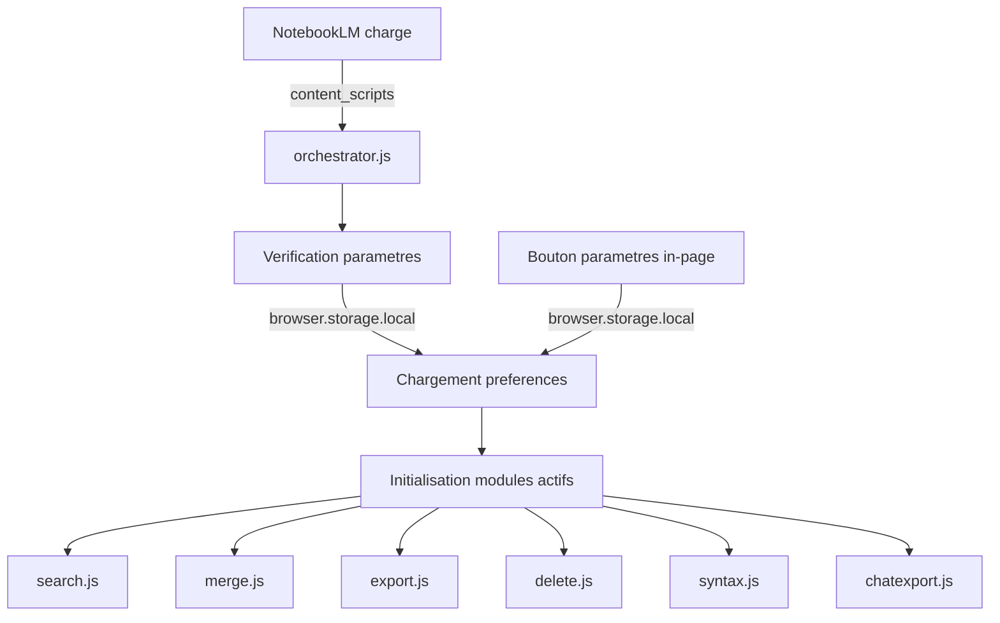

# Architecture — Magic Manager for NotebookLM

## Vue d'ensemble

Magic Manager est une extension Firefox (Manifest V3) de type **content-script-only**. Elle ne possède ni background script, ni service worker permanent. Toute la logique s'exécute dans le contexte de la page NotebookLM via des content scripts injectés.

## Arborescence du projet

```
magic-manager/
├── manifest.json              # Manifeste MV3 de l'extension
├── src/
│   ├── api/
│   │   └── rpcclient.js       # Client RPC pour l'API NotebookLM (batchexecute)
│   ├── content/
│   │   ├── orchestrator.js    # Point d'entrée — orchestrateur des modules
│   │   ├── modules/           # Sous-modules de l'extension
│   │   │   ├── source-helpers.js # Fonctions centralisées DOM des sources
│   │   │   ├── search.js      # Module de recherche globale
│   │   │   ├── merge.js       # Module de fusion intelligente
│   │   │   ├── export.js      # Module d'exports simplifiés
│   │   │   ├── delete.js      # Module de suppression en ligne
│   │   │   ├── syntax.js      # Module de coloration syntaxique
│   │   │   └── chatexport.js  # Module d'export du chat
│   │   └── ui/                # Composants d'interface partagés
│   │       ├── dialogs.js     # Boîtes de dialogue Material Design 3
│   │       └── settings.js    # Panneau de réglages utilisateur
│   ├── popup/
│   │   ├── popup.html         # Interface de la popup de paramètres
│   │   ├── popup.js           # Logique de la popup
│   │   └── popup.css          # Styles de la popup
│   └── styles/
│       └── magic-manager.css  # Styles injectés dans la page NotebookLM
├── _locales/
│   ├── en/messages.json       # Locale par défaut (anglais)
│   ├── fr/messages.json       # Français
│   ├── es/messages.json       # Espagnol
│   ├── de/messages.json       # Allemand
│   ├── pt/messages.json       # Portugais brésilien
│   ├── ja/messages.json       # Japonais
│   └── vi/messages.json       # Vietnamien
├── icons/
│   ├── icon.svg               # Icône vectorielle (SVG standardisé)
├── tools/
│   └── check-i18n.js          # Vérification de couverture i18n
├── README.md
├── ARCHITECTURE.md
├── CHANGELOG.md
├── AGENTS.md
├── spec.md
├── LICENSE
└── .gitignore
```

## Flux de données



## Système i18n

L'extension utilise le système natif `browser.i18n.getMessage()` de WebExtension :
- **Locale par défaut** : `en` (définie dans `manifest.json` via `default_locale`)
- **7 locales supportées** : en, fr, es, de, pt, ja, vi
- **Clés normalisées** : camelCase, sans préfixe de module
- **Vérification** : `node tools/check-i18n.js` valide la couverture de toutes les locales cibles

## Paramétrage

Chaque fonctionnalité peut être activée/désactivée individuellement via le micro-menu de paramètres (⚙️) injecté directement dans la page en bas à gauche de la liste des sources. Les préférences sont stockées dans `browser.storage.local` avec les clés suivantes :

| Clé | Type | Défaut | Description |
|---|---|---|---|
| `feature_search` | `boolean` | `true` | Recherche globale |
| `feature_merge` | `boolean` | `true` | Fusion intelligente |
| `feature_export` | `boolean` | `true` | Exports simplifiés |
| `feature_delete` | `boolean` | `true` | Suppression en ligne |
| `feature_syntax` | `boolean` | `true` | Coloration syntaxique |
| `feature_chatExport` | `boolean` | `true` | Export du chat |

## Couche de transport RPC

L'extension s'affranchit des simulations d'interactions DOM (fragiles et sources d'effets visuels secondaires) pour les opérations lourdes en exploitant directement l'API interne `batchexecute` de Google NotebookLM :
- **Résilience réseau (v0.5.4)** : Intégration d'un timeout de 30 secondes (via `AbortController`) et d'un retry exponentiel adaptatif (3 tentatives, gestion de `Retry-After`) sur toutes les requêtes RPC.
- **GET_SOURCE (`hizoJc`)** : Permet de récupérer le texte brut indexé d'une source à l'index `[3][0]` (ou l'HTML de rendu à `[4][1]`), sans charger le document dans le visualiseur DOM de la page.
- **CREATE_NOTE (`CYK0Xb`) / UPDATE_NOTE (`cYAfTb`)** : Création séquentielle robuste en tâche de fond pour exporter les conversations de chat en notes sans focus automatique de l'interface Google.
- **DELETE_SOURCE (`tGMBJ`) / ADD_SOURCE (`izAoDd`)** : Appels directs utilisant des structures de tableaux doublement et triplement enveloppées pour des mutations réseau résilientes.

## Composants d'interface (Modales & Dialogues)

Depuis la version 0.5.4, toutes les boîtes de dialogue et la modale de fusion utilisent l'élément HTML5 natif `<dialog>`. Cela garantit :
- Un comportement standardisé de la modale via `.showModal()`.
- Une gestion native et sécurisée du Focus Trap (le focus clavier reste piégé dans le dialogue).
- Une fermeture automatique et cohérente via la touche `Escape` (via l'événement `cancel` intercepté).
- Une conformité totale avec les critères WCAG 2.1 AA pour l'accessibilité des modales (rôles et états ARIA intégrés).
- **Protection Anti-Processus Fantôme (v0.5.9)** : Afin d'éviter qu'un traitement asynchrone (comme la fusion de sources) ne continue à s'exécuter en tâche de fond après la fermeture ou l'annulation de la modale par l'utilisateur, un témoin d'annulation (`isCancelled`) est lié à l'événement `close` du dialogue et interrompt immédiatement le traitement réseau et la création de sources.

## Cycle d'observation, Performance et Mode Mobile (Coordinateur)

Pour garantir une expérience utilisateur fluide sur la SPA NotebookLM sans pénaliser les performances :
- **Observer Centralisé** : Au lieu d'avoir plusieurs MutationObservers concurrents scrutant `document.body` en continu, un unique observateur global dans `panel-observer.js` centralise la surveillance du DOM. Avec un debounce de 250ms, il coordonne et distribue les injections pour la barre de recherche, l'export de chat, et la coloration syntaxique.
- **Délégation d'Événements & Recalcul Réactif** : Le recalcul du nombre de sources sélectionnées (fusion et export par lot) est déclenché réactivement par la délégation d'événements de clics et changements de formulaires. De plus, les modifications DOM des cases à cocher par Angular déclenchent automatiquement la mise à jour par l'intermédiaire du répartiteur d'injection global, sans clics superflus de l'utilisateur.
- **Verrou d'Idempotence par Compteur (v0.5.9)** : Pour éliminer toute boucle infinie d'injections réactives (cycles de mutation DOM provoquant des réinjections en cascade), les fonctions de boutons batch s'appuient sur un double verrou d'idempotence basé sur le nombre de sources cochées. Si le compte n'a pas changé et que le bouton est déjà présent dans la bonne ancre, le DOM n'est pas modifié, stoppant net les boucles de l'observateur.
- **Optimisation DOM native** : L'utilisation de traversées récursives du Shadow DOM a été entièrement abandonnée au profit de requêtes CSS `querySelectorAll` natives. Le chat et la liste des sources de NotebookLM utilisant l'émulation CSS d'Angular, ce changement apporte un gain de performance immédiat de 10x à 50x sur les interactions.
- **ResizeObserver & En-tête mobile** : Un `ResizeObserver` écoute en permanence le redimensionnement du document. Si la visibilité réelle des panneaux sources et chat (mesurée par `offsetParent`) indique un basculement de layout (passage en mode onglets), Magic Manager bascule ses injections :
  - **En-tête Mobile Collant** : Création d'une barre fixe `.mm-sticky-header` en haut de la liste de sources, regroupant à gauche la barre de recherche et à droite les boutons batch (fusion/export), empêchant leur défilement ou disparition au scroll.
  - **Ancrage Individuel Résilient** : Si le header de section est masqué, les boutons individuels d'export et de suppression s'ancrent automatiquement sur le bouton natif de retour/fermeture (`button[mattooltip="Close source view"]`) du document ouvert.


## Conventions

- **Préfixe de log** : `[MM]` pour tous les messages console
- **Commentaires** : en français
- **Auteur** : MTF Karukera
- **Licence** : MPL-2.0
