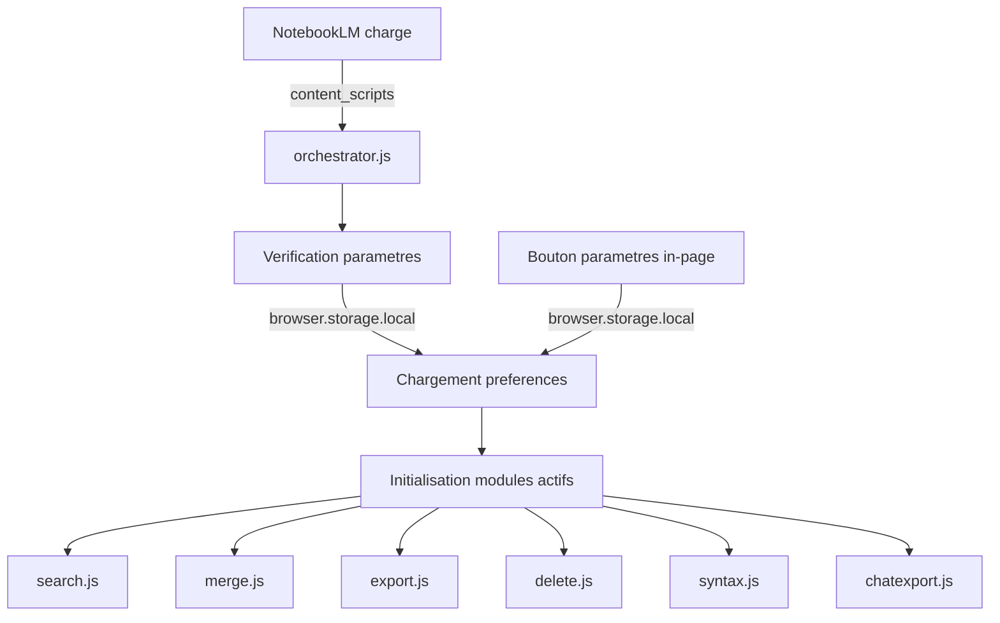

# Architecture — Magic Manager for NotebookLM

## Vue d'ensemble

Magic Manager est une extension Firefox (Manifest V3) de type **content-script-only**. Elle ne possède ni background script, ni service worker permanent. Toute la logique s'exécute dans le contexte de la page NotebookLM via des content scripts injectés.

## Arborescence du projet

```
magic-manager/
├── manifest.json              # Manifeste MV3 de l'extension
├── src/
│   ├── api/
│   │   └── rpcclient.js       # Client RPC pour l'API NotebookLM (batchexecute)
│   ├── content/
│   │   ├── orchestrator.js    # Point d'entrée — orchestrateur des modules
│   │   ├── modules/           # Sous-modules de l'extension
│   │   │   ├── search.js      # Module de recherche globale
│   │   │   ├── merge.js       # Module de fusion intelligente
│   │   │   ├── export.js      # Module d'exports simplifiés
│   │   │   ├── delete.js      # Module de suppression en ligne
│   │   │   ├── syntax.js      # Module de coloration syntaxique
│   │   │   └── chatexport.js  # Module d'export du chat
│   │   └── ui/                # Composants d'interface partagés
│   ├── popup/
│   │   ├── popup.html         # Interface de la popup de paramètres
│   │   ├── popup.js           # Logique de la popup
│   │   └── popup.css          # Styles de la popup
│   └── styles/
│       └── content.css        # Styles injectés dans la page NotebookLM
├── _locales/
│   ├── en/messages.json       # Locale par défaut (anglais)
│   ├── fr/messages.json       # Français
│   ├── es/messages.json       # Espagnol
│   ├── de/messages.json       # Allemand
│   ├── pt/messages.json       # Portugais brésilien
│   ├── ja/messages.json       # Japonais
│   └── vi/messages.json       # Vietnamien
├── icons/
│   ├── icon-48.png
│   └── icon-128.png
├── tools/
│   └── check-i18n.js          # Vérification de couverture i18n
├── README.md
├── ARCHITECTURE.md
├── CHANGELOG.md
├── AGENTS.md
├── spec.md
├── LICENSE
└── .gitignore
```

## Flux de données



## Système i18n

L'extension utilise le système natif `browser.i18n.getMessage()` de WebExtension :
- **Locale par défaut** : `en` (définie dans `manifest.json` via `default_locale`)
- **7 locales supportées** : en, fr, es, de, pt, ja, vi
- **Clés normalisées** : camelCase, sans préfixe de module
- **Vérification** : `node tools/check-i18n.js` valide la couverture de toutes les locales cibles

## Paramétrage

Chaque fonctionnalité peut être activée/désactivée individuellement via le micro-menu de paramètres (⚙️) injecté directement dans la page en bas à gauche de la liste des sources. Les préférences sont stockées dans `browser.storage.local` avec les clés suivantes :

| Clé | Type | Défaut | Description |
|---|---|---|---|
| `feature_search` | `boolean` | `true` | Recherche globale |
| `feature_merge` | `boolean` | `true` | Fusion intelligente |
| `feature_export` | `boolean` | `true` | Exports simplifiés |
| `feature_delete` | `boolean` | `true` | Suppression en ligne |
| `feature_syntax` | `boolean` | `true` | Coloration syntaxique |
| `feature_chatExport` | `boolean` | `true` | Export du chat |

## Couche de transport RPC

L'extension s'affranchit des simulations d'interactions DOM (fragiles et sources d'effets visuels secondaires) pour les opérations lourdes en exploitant directement l'API interne `batchexecute` de Google NotebookLM :
- **GET_SOURCE (`hizoJc`)** : Permet de récupérer le texte brut indexé d'une source à l'index `[3][0]` (ou l'HTML de rendu à `[4][1]`), sans charger le document dans le visualiseur DOM de la page.
- **CREATE_NOTE (`CYK0Xb`) / UPDATE_NOTE (`cYAfTb`)** : Création séquentielle robuste en tâche de fond pour exporter les conversations de chat en notes sans focus automatique de l'interface Google.
- **DELETE_SOURCE (`tGMBJ`) / ADD_SOURCE (`izAoDd`)** : Appels directs utilisant des structures de tableaux doublement et triplement enveloppées pour des mutations réseau résilientes.

## Conventions

- **Préfixe de log** : `[MM]` pour tous les messages console
- **Commentaires** : en français
- **Auteur** : MTF Karukera
- **Licence** : MPL-2.0
